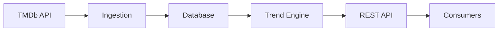
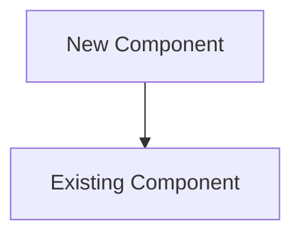

# 📋 Documentation Overview - What Was Created

## 🎯 Summary

I've created a **comprehensive, shareable visual documentation system** for your Movie Trends API using:

- ✅ **MkDocs Material** - Beautiful, responsive documentation framework
- ✅ **Mermaid.js** - Interactive architecture diagrams
- ✅ **Docker** - One-command deployment
- ✅ **Live Reload** - Instant preview of changes

---

## 📁 What's Inside

### Complete Documentation Site

```
movie_trends_api/docs/
├── 📄 README.md                  # Main documentation guide
├── 📄 QUICKSTART.md              # 60-second setup guide
├── 📄 DOCUMENTATION_OVERVIEW.md  # This file
├── 🐳 docker-compose.yml         # Docker setup
├── 🐳 Dockerfile                 # Container image
├── ⚙️ mkdocs.yml                # Site configuration
│
└── docs/                         # Content directory
    ├── 🏠 index.md              # Homepage
    │
    ├── 🏗️ architecture/         # System architecture
    │   ├── overview.md          # High-level design
    │   ├── system-design.md     # Component breakdown
    │   ├── data-flow.md         # Data movement
    │   └── api-layer.md         # API design
    │
    ├── 🧩 components/           # Component deep dives
    │   ├── ingestion.md         # Data ingestion
    │   ├── trend-scoring.md     # Scoring engine
    │   ├── transformation.md    # Data transformation
    │   ├── api-endpoints.md     # REST endpoints
    │   └── database.md          # Database schema
    │
    ├── ⚙️ how-it-works/         # Process explanations
    │   ├── pipeline.md          # Data pipeline
    │   ├── trend-calculation.md # Formula deep dive
    │   └── request-flow.md      # API request flow
    │
    ├── 🚀 deployment/           # Deployment guides
    │   ├── docker.md            # Docker setup
    │   ├── configuration.md     # Configuration
    │   └── monitoring.md        # Monitoring
    │
    ├── 📡 api/                  # API reference
    │   ├── endpoints.md         # Complete endpoint docs
    │   ├── schemas.md           # Data models
    │   └── examples.md          # Usage examples
    │
    └── 🎨 stylesheets/          # Custom styling
        └── extra.css            # Theme customization
```

---

## 🎨 Key Features

### 1. Interactive Architecture Diagrams



**Every diagram is:**
- ✅ Clickable and interactive
- ✅ Auto-generated from code
- ✅ Responsive for mobile
- ✅ Printable

### 2. Explainable Trend Formula

Complete mathematical breakdown with:
- Formula components
- Step-by-step calculations
- Real-world examples
- LaTeX math rendering

### 3. Complete API Documentation

- All REST endpoints
- Request/response examples
- Error codes
- Rate limiting
- Authentication (future)

### 4. Docker Integration

One command to rule them all:
```bash
docker-compose up -d
```

---

## 🚀 How to Use

### Quick Start (60 seconds)

1. **Open Terminal in docs folder:**
   ```powershell
   cd "C:\Users\manuel.deluzi\OneDrive - Havas\Projects\personali\taxi_drivers\APIs\movie_trends_api\docs"
   ```

2. **Start Docker:**
   ```powershell
   docker-compose up -d
   ```

3. **Open Browser:**
   ```powershell
   start http://localhost:8001
   ```

That's it! 🎉

---

## 📊 What You'll See

### Homepage
- Overview of the API
- System architecture diagram
- Quick navigation cards
- Feature highlights

### Architecture Section
- System context diagram
- Layered architecture
- Component interactions
- Data flow visualization
- Security architecture

### How It Works Section
- Complete data pipeline flow
- Trend calculation with math
- Request lifecycle
- Performance optimizations

### API Reference
- All endpoints documented
- Query parameters
- Response schemas
- Error handling
- Code examples

---

## 🎯 Use Cases

### For You
- 📖 **Onboarding** - Understand the entire system quickly
- 🐛 **Debugging** - Visual flow to trace issues
- 📝 **Planning** - See where to add features
- 🎓 **Learning** - Deep dive into architecture

### For Team
- 👥 **Collaboration** - Shared understanding
- 📊 **Presentations** - Diagrams for meetings
- 🔗 **Sharing** - Send link to stakeholders
- 📚 **Reference** - Quick lookup

### For External
- 🤝 **Partners** - Integration guide
- 💼 **Clients** - Professional documentation
- 🎓 **Training** - Teaching material
- 📢 **Marketing** - Showcase architecture

---

## 🔄 Live Reload

Any changes you make to the markdown files are **instantly visible** in the browser:

1. Edit `docs/docs/index.md`
2. Save the file
3. Browser auto-refreshes
4. See your changes immediately

No rebuild needed! ⚡

---

## 📤 Sharing Options

### Option 1: Docker Image (Easiest)

```bash
# Build image
docker build -t movie-trends-docs ./docs

# Share with team
docker push your-registry/movie-trends-docs

# They run it
docker run -p 8001:8001 movie-trends-docs
```

### Option 2: Static Website

```bash
# Build static files
docker-compose exec docs mkdocs build

# Upload ./site/ folder to:
# - GitHub Pages (free)
# - Netlify (free)
# - Vercel (free)
# - AWS S3 + CloudFront
# - Any web server
```

### Option 3: PDF Export

```bash
# Install plugin
pip install mkdocs-pdf-export-plugin

# Build PDF
mkdocs build

# Share PDF file
```

---

## 🎨 Customization

### Change Theme Colors

Edit `docs/mkdocs.yml`:
```yaml
theme:
  palette:
    primary: deep purple  # Change this
    accent: pink         # And this
```

### Add Your Logo

1. Add logo image to `docs/docs/assets/`
2. Update `mkdocs.yml`:
```yaml
theme:
  logo: assets/logo.png
```

### Add New Pages

1. Create markdown file: `docs/docs/new-section/new-page.md`
2. Add to navigation in `mkdocs.yml`:
```yaml
nav:
  - New Section:
      - New Page: new-section/new-page.md
```

---

## 📈 What Makes This Special

### Compared to Basic README
- ✅ Multi-page organization
- ✅ Interactive diagrams
- ✅ Beautiful theme
- ✅ Search functionality
- ✅ Mobile responsive

### Compared to Static Docs
- ✅ Live reload for development
- ✅ Containerized (no dependency hell)
- ✅ Version controlled
- ✅ Easy to share

### Compared to Wiki
- ✅ Markdown-based (Git-friendly)
- ✅ No separate hosting needed
- ✅ Offline capable
- ✅ Fast and lightweight

---

## 🛠️ Maintenance

### Update Documentation

```bash
# 1. Edit markdown files in docs/docs/
# 2. Preview changes (auto-reloads)
# 3. Commit to Git
# 4. Done!
```

### Update Diagrams

Edit Mermaid syntax directly in markdown:

````markdown

````

### Add Dependencies

Edit `docs/requirements.txt` (if needed):
```
mkdocs-material
mkdocs-mermaid2-plugin
# Add more plugins
```

Then rebuild:
```bash
docker-compose build --no-cache
docker-compose up -d
```

---

## 📚 Documentation Highlights

### Architecture Diagrams Include:
- ✅ System context (C4 model)
- ✅ Layered architecture
- ✅ Component interactions
- ✅ Data flow sequences
- ✅ Database schema (ER diagram)
- ✅ Deployment architecture
- ✅ Security layers

### Formula Documentation Shows:
- ✅ Mathematical notation (LaTeX)
- ✅ Step-by-step breakdown
- ✅ Real examples with numbers
- ✅ Edge case handling
- ✅ Code implementation

### API Docs Cover:
- ✅ All endpoints
- ✅ Request parameters
- ✅ Response schemas
- ✅ Error codes
- ✅ Rate limiting
- ✅ Code examples (Python, curl)

---

## 🎓 Learning Path

Recommended reading order:

1. **Start**: [Homepage](docs/index.md) - Get overview
2. **Architecture**: [Overview](docs/architecture/overview.md) - Understand design
3. **Data Flow**: [Data Flow](docs/architecture/data-flow.md) - See data movement
4. **Trend Calc**: [Trend Calculation](docs/how-it-works/trend-calculation.md) - Learn formula
5. **API Usage**: [Endpoints](docs/api/endpoints.md) - Use the API

---

## 🔗 Important URLs

| What | URL |
|------|-----|
| **Documentation** | http://localhost:8001 |
| **API Server** | http://localhost:8000 |
| **API Docs** | http://localhost:8000/docs |
| **Health Check** | http://localhost:8000/health |
| **Metrics** | http://localhost:8000/metrics |

---

## 💡 Pro Tips

### Tip 1: Search Everything
Press `/` or `S` to search across all documentation instantly.

### Tip 2: Dark Mode
Click the theme toggle (sun/moon icon) in the header.

### Tip 3: Mobile Viewing
Open on your phone - it's fully responsive!

### Tip 4: Print/PDF
Use browser's print function (Ctrl+P) to save as PDF.

### Tip 5: Permalinks
Every heading has a permalink - hover to get the link.

---

## 🆘 Troubleshooting

### "Port 8001 already in use"

**Solution:**
```yaml
# Edit docker-compose.yml
ports:
  - "8002:8001"  # Use different port
```

### "Docker daemon not running"

**Solution:**
1. Start Docker Desktop
2. Wait for it to fully start
3. Try again

### "Diagrams not showing"

**Solution:**
```bash
# Clear browser cache (Ctrl+Shift+R)
# Or rebuild container
docker-compose build --no-cache
docker-compose up -d
```

### "Changes not appearing"

**Solution:**
```bash
# Restart container
docker-compose restart

# Or rebuild
docker-compose down
docker-compose up -d
```

---

## 📞 Next Steps

### Immediate Actions:
1. ✅ Follow [QUICKSTART.md](QUICKSTART.md) to launch docs
2. ✅ Browse through all sections
3. ✅ Share with your team

### Future Enhancements:
- Add more component diagrams
- Create video walkthroughs
- Add API playground
- Generate OpenAPI spec
- Create Postman collection

---

## 🎉 Summary

You now have a **production-ready, shareable, interactive documentation system** for your Movie Trends API!

**What makes it special:**
- 🎨 Beautiful Material Design theme
- 📊 Interactive Mermaid diagrams
- 🐳 One-command Docker deployment
- 🔄 Live reload for development
- 📱 Mobile responsive
- 🔍 Full-text search
- 🌓 Dark/light mode
- 📝 Easy to maintain
- 🚀 Fast and lightweight
- 🌐 Shareable with anyone

---

**Ready to explore? Start here:**

```powershell
cd "movie_trends_api/docs"
docker-compose up -d
start http://localhost:8001
```

**Enjoy your new documentation! 🎬📚**
