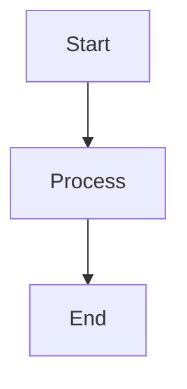

# 📚 Movie Trends API - Visual Documentation

> **Interactive, shareable architecture documentation with live diagrams**

This directory contains comprehensive visual documentation for the Movie Trends Data Product API, built with MkDocs Material and running in Docker.

---

## 🚀 Quick Start

### Option 1: Docker (Recommended)

```bash
# Start documentation server
cd movie_trends_api/docs
docker-compose up -d

# Open in browser
start http://localhost:8001
```

### Option 2: Local Python

```bash
# Install dependencies
pip install mkdocs-material mkdocs-mermaid2-plugin pymdown-extensions

# Serve locally
cd movie_trends_api/docs
mkdocs serve -a 0.0.0.0:8001
```

---

## 📖 What's Documented

### Architecture
- **System Overview** - High-level architecture and design principles
- **Component Breakdown** - Detailed service architecture
- **Data Flow** - How data moves through the system
- **API Layer** - REST endpoint design

### Components
- **Ingestion Service** - TMDb data fetching and storage
- **Trend Scoring Engine** - Explainable trend calculation formula
- **Transformation Layer** - Data normalization and enrichment
- **Database Schema** - PostgreSQL table structures

### How It Works
- **Data Pipeline** - Step-by-step data processing flow
- **Trend Calculation** - Deep dive into the scoring formula with examples
- **Request Flow** - API request lifecycle

### Deployment
- **Docker Setup** - Multi-container orchestration
- **Configuration** - Environment variables and settings
- **Monitoring** - Observability and metrics

### API Reference
- **Endpoints** - Complete REST API documentation
- **Schemas** - Pydantic models and validation
- **Examples** - Real-world usage examples

---

## 🎯 Features

- ✅ **Interactive Mermaid Diagrams** - Click and explore architecture visually
- ✅ **Live Reload** - Changes to docs auto-refresh in browser
- ✅ **Dark/Light Mode** - Automatic theme switching
- ✅ **Search** - Full-text search across all documentation
- ✅ **Mobile Responsive** - Works on all devices
- ✅ **Math Rendering** - KaTeX for formula display
- ✅ **Code Highlighting** - Syntax highlighting for all languages

---

## 📂 Structure

```
docs/
├── mkdocs.yml                 # MkDocs configuration
├── docker-compose.yml         # Docker setup
├── Dockerfile                 # Documentation container
├── docs/                      # Markdown content
│   ├── index.md              # Homepage
│   ├── architecture/         # Architecture docs
│   │   ├── overview.md
│   │   ├── system-design.md
│   │   ├── data-flow.md
│   │   └── api-layer.md
│   ├── components/           # Component deep dives
│   │   ├── ingestion.md
│   │   ├── trend-scoring.md
│   │   ├── transformation.md
│   │   ├── api-endpoints.md
│   │   └── database.md
│   ├── how-it-works/         # Workflows & processes
│   │   ├── pipeline.md
│   │   ├── trend-calculation.md
│   │   └── request-flow.md
│   ├── deployment/           # Deployment guides
│   │   ├── docker.md
│   │   ├── configuration.md
│   │   └── monitoring.md
│   ├── api/                  # API reference
│   │   ├── endpoints.md
│   │   ├── schemas.md
│   │   └── examples.md
│   └── stylesheets/          # Custom CSS
│       └── extra.css
└── README.md                 # This file
```

---

## 🛠️ Technologies

| Technology | Purpose |
|------------|---------|
| **MkDocs Material** | Documentation framework |
| **Mermaid.js** | Interactive diagrams |
| **PyMdown Extensions** | Enhanced Markdown features |
| **Docker** | Containerization |
| **KaTeX** | Math equation rendering |

---

## 🎨 Customization

### Theme Colors

Edit `mkdocs.yml`:

```yaml
theme:
  palette:
    primary: deep purple
    accent: pink
```

### Custom CSS

Add styles to `docs/stylesheets/extra.css`:

```css
:root {
    --md-primary-fg-color: #673AB7;
    --md-accent-fg-color: #E91E63;
}
```

### Add New Pages

1. Create markdown file in `docs/`
2. Add to navigation in `mkdocs.yml`:

```yaml
nav:
  - New Section:
      - Page Title: path/to/page.md
```

---

## 📊 Creating Diagrams

### Mermaid Syntax

````markdown

````

### Supported Diagram Types

- **Flowcharts** - Process flows
- **Sequence Diagrams** - Interaction flows
- **Class Diagrams** - Object models
- **State Diagrams** - State machines
- **ER Diagrams** - Database schemas
- **Gantt Charts** - Timelines

[Mermaid Documentation →](https://mermaid.js.org/)

---

## 🔧 Commands

### Development

```bash
# Start with live reload
docker-compose up

# Rebuild container
docker-compose up --build

# Stop server
docker-compose down
```

### Production Build

```bash
# Build static site
docker-compose exec docs mkdocs build

# Output in ./site/ directory
```

### View Logs

```bash
# Follow logs
docker-compose logs -f docs

# Last 50 lines
docker-compose logs --tail=50 docs
```

---

## 🌐 Sharing Documentation

### Option 1: Docker Image

```bash
# Build and push
docker build -t your-registry/movie-trends-docs:latest ./docs
docker push your-registry/movie-trends-docs:latest

# Others can run
docker run -p 8001:8001 your-registry/movie-trends-docs:latest
```

### Option 2: Static Hosting

```bash
# Build static site
mkdocs build

# Deploy to:
# - GitHub Pages
# - Netlify
# - Vercel
# - AWS S3 + CloudFront
# - Any static host
```

### Option 3: PDF Export

```bash
# Install plugin
pip install mkdocs-pdf-export-plugin

# Add to mkdocs.yml
plugins:
  - pdf-export

# Build with PDF
mkdocs build
```

---

## 🔍 Search Configuration

The documentation includes full-text search powered by lunr.js:

```yaml
plugins:
  - search:
      lang: en
      separator: '[\s\-\.]+'
```

Search indexes:
- Page titles
- Headings
- Body content
- Code blocks

---

## 📱 Mobile Access

The documentation is fully responsive and mobile-optimized:

- 📱 Touch-friendly navigation
- 💨 Fast loading on mobile networks
- 🔍 Mobile-optimized search
- 📊 Responsive diagrams

---

## 🚢 Deployment Options

### GitHub Pages

```bash
# Build and deploy
mkdocs gh-deploy
```

### Docker Production

```dockerfile
FROM squidfunk/mkdocs-material:latest
WORKDIR /docs
COPY . .
RUN mkdocs build
FROM nginx:alpine
COPY --from=0 /docs/site /usr/share/nginx/html
```

### Kubernetes

```yaml
apiVersion: v1
kind: Service
metadata:
  name: docs
spec:
  selector:
    app: movie-trends-docs
  ports:
    - port: 80
      targetPort: 8001
---
apiVersion: apps/v1
kind: Deployment
metadata:
  name: docs
spec:
  replicas: 2
  selector:
    matchLabels:
      app: movie-trends-docs
  template:
    metadata:
      labels:
        app: movie-trends-docs
    spec:
      containers:
      - name: docs
        image: movie-trends-docs:latest
        ports:
        - containerPort: 8001
```

---

## 🤝 Contributing

To add or update documentation:

1. **Edit markdown files** in `docs/` directory
2. **Preview locally** with `docker-compose up`
3. **Commit changes** to version control
4. **Deploy** via your preferred method

### Guidelines

- Use clear, concise language
- Include code examples
- Add diagrams for complex concepts
- Keep navigation shallow (max 3 levels)
- Test all links

---

## 📈 Analytics (Optional)

Add Google Analytics to track documentation usage:

```yaml
# mkdocs.yml
extra:
  analytics:
    provider: google
    property: G-XXXXXXXXXX
```

---

## 🆘 Troubleshooting

### Port Already in Use

```bash
# Use different port
# Edit docker-compose.yml:
ports:
  - "8002:8001"
```

### Diagrams Not Rendering

```bash
# Clear browser cache
# Or rebuild container
docker-compose build --no-cache
```

### Permission Errors

```bash
# Fix ownership
chown -R $USER:$USER docs/
```

---

## 📚 Resources

- [MkDocs Documentation](https://www.mkdocs.org/)
- [Material for MkDocs](https://squidfunk.github.io/mkdocs-material/)
- [Mermaid.js](https://mermaid.js.org/)
- [PyMdown Extensions](https://facelessuser.github.io/pymdown-extensions/)

---

## 📄 License

This documentation is part of the Movie Trends API project.

---

**🎬 Happy Documenting!**

For questions or issues, see the main [Movie Trends API README](../README.md).
