# Data Flow Architecture

## End-to-End Data Journey

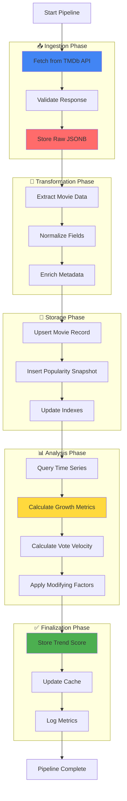

## Phase 1: Data Ingestion

### TMDb API Request Flow

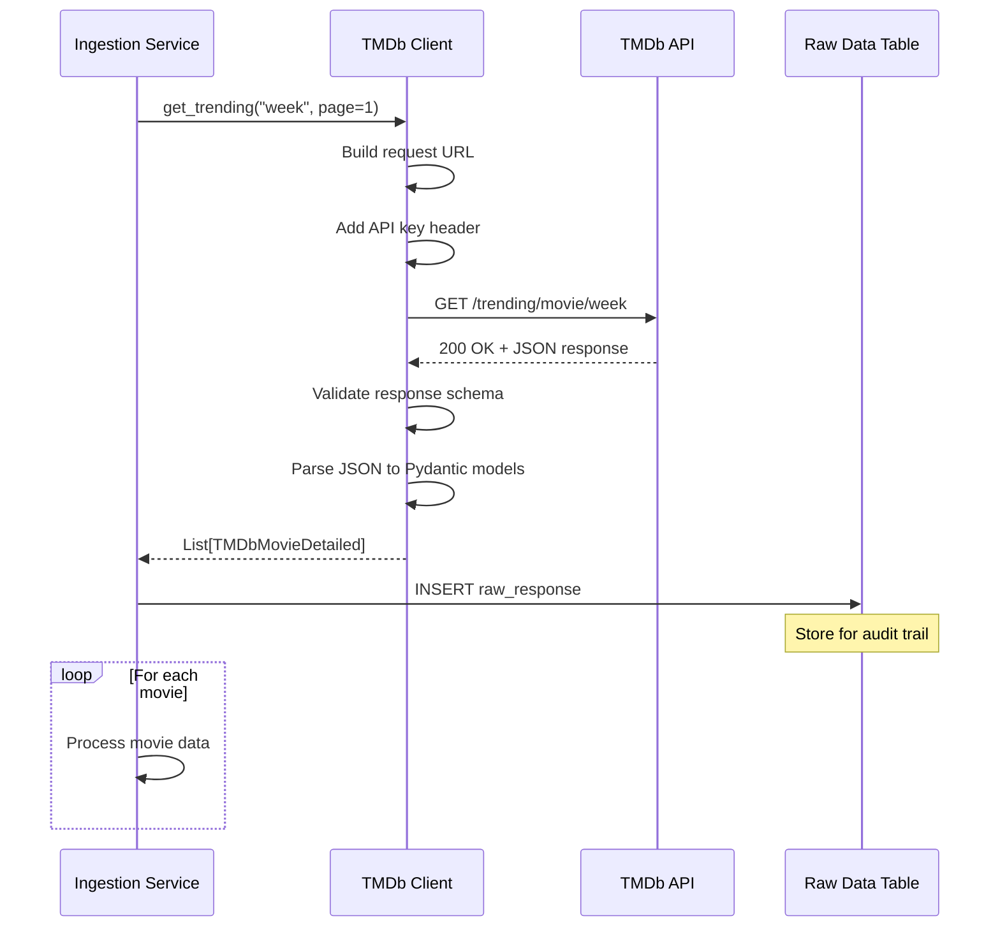

### Data Validation

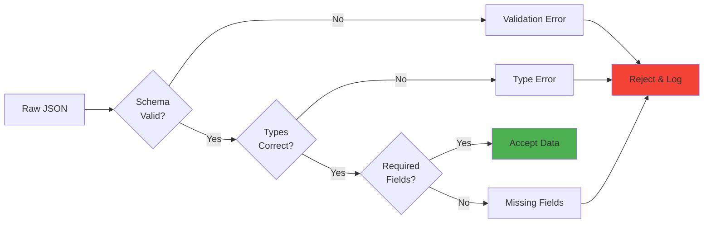

## Phase 2: Data Transformation

### Movie Data Normalization

```mermaid
graph TB
    subgraph "Input: TMDb Response"
        TMDB_ID[id: 558449]
        TMDB_TITLE[title: 'Gladiator II']
        TMDB_DATE[release_date: '2024-11-13']
        TMDB_GENRES[genre_ids: [28, 12, 18]]
        TMDB_POP[popularity: 3456.789]
    end
    
    subgraph "Transformation Logic"
        MAP_GENRES[Map genre IDs → names]
        PARSE_DATE[Parse ISO date string]
        NORMALIZE_POP[Normalize popularity score]
        EXTRACT_YEAR[Extract release year]
    end
    
    subgraph "Output: Database Model"
        DB_ID[movie_id: 558449]
        DB_TITLE[title: 'Gladiator II']
        DB_DATE[release_date: Date object]
        DB_GENRES[genres: ['Action', 'Adventure', 'Drama']]
        DB_YEAR[release_year: 2024]
    end
    
    TMDB_ID --> DB_ID
    TMDB_TITLE --> DB_TITLE
    TMDB_DATE --> PARSE_DATE --> DB_DATE
    TMDB_GENRES --> MAP_GENRES --> DB_GENRES
    TMDB_DATE --> EXTRACT_YEAR --> DB_YEAR
    TMDB_POP --> NORMALIZE_POP
    
    style MAP_GENRES fill:#FFD93D
    style PARSE_DATE fill:#FFD93D
    style NORMALIZE_POP fill:#FFD93D
```

### Popularity Snapshot Creation

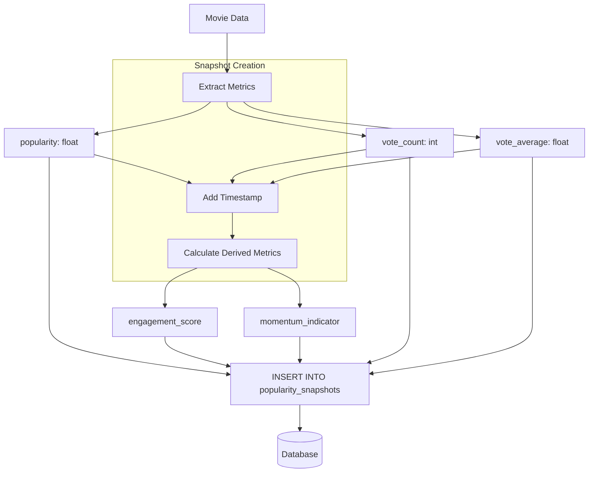

## Phase 3: Trend Calculation

### Time Series Analysis

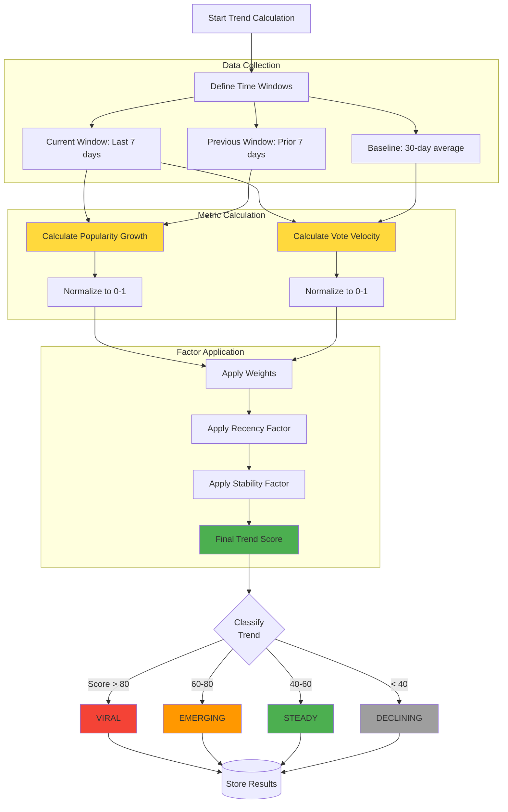

### Trend Score Formula Breakdown

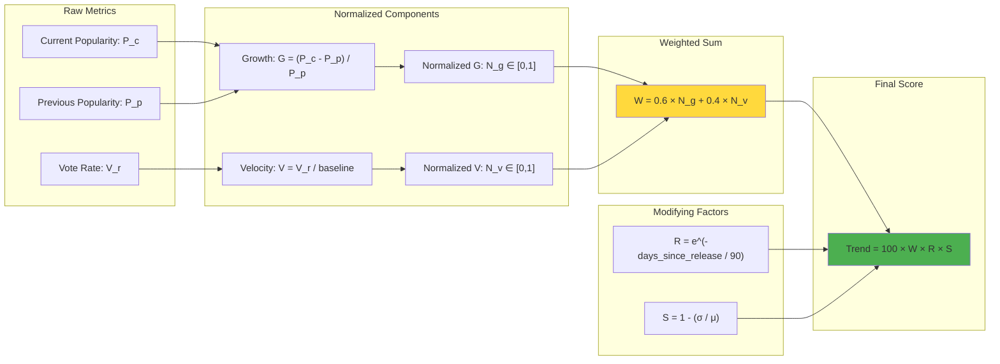

## Phase 4: API Response Flow

### Query Execution Path

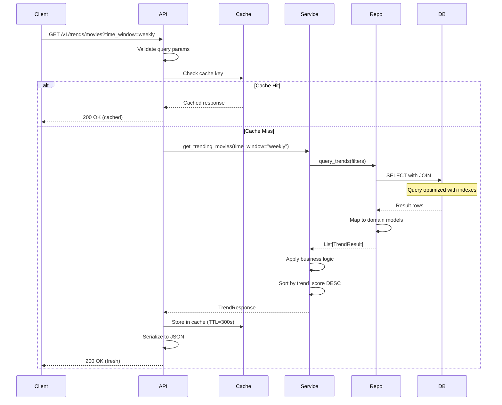

### Response Serialization

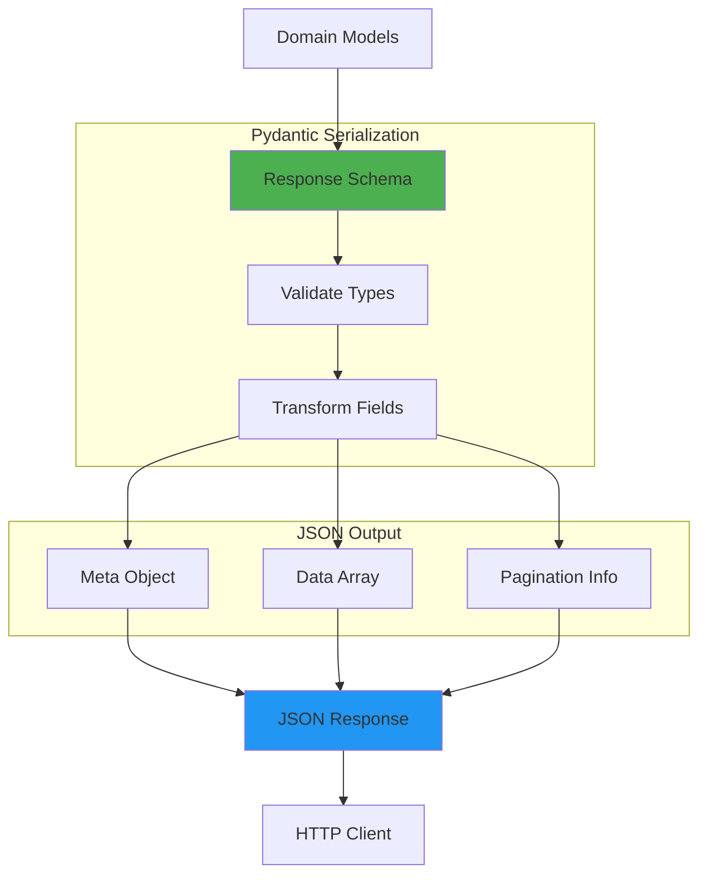

## Data Retention & Archival

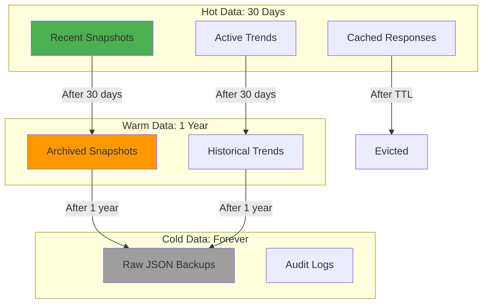

## Error Handling Flow

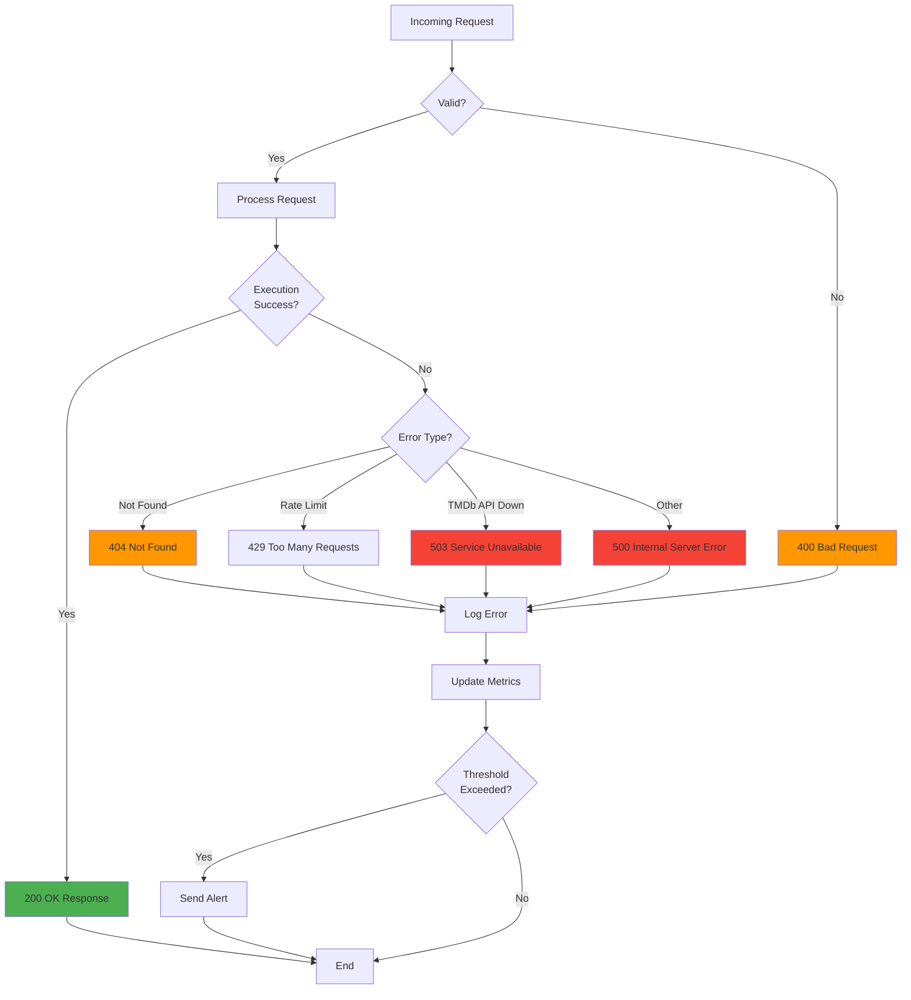

## Performance Optimization Flow

```mermaid
graph TB
    subgraph "Query Optimization"
        INDEX[Database Indexes]
        MATERIALIZED[Materialized Views]
        PARTITION[Table Partitioning]
    end
    
    subgraph "Caching Strategy"
        REDIS_CACHE[Redis Cache Layer]
        QUERY_CACHE[Query Result Cache]
        RESPONSE_CACHE[Response Cache]
    end
    
    subgraph "Connection Pooling"
        ASYNC_POOL[Async Connection Pool]
        POOL_SIZE[Max Pool Size: 20]
        MIN_CONN[Min Connections: 5]
    end
    
    subgraph "Batch Processing"
        BULK_INSERT[Bulk Insert Operations]
        BATCH_UPDATE[Batch Updates]
        PARALLEL[Parallel Processing]
    end
    
    INDEX --> FAST_QUERY[Fast Query Execution]
    MATERIALIZED --> FAST_QUERY
    PARTITION --> FAST_QUERY
    
    REDIS_CACHE --> REDUCED_LOAD[Reduced DB Load]
    QUERY_CACHE --> REDUCED_LOAD
    RESPONSE_CACHE --> REDUCED_LOAD
    
    ASYNC_POOL --> EFFICIENT_IO[Efficient I/O]
    POOL_SIZE --> EFFICIENT_IO
    MIN_CONN --> EFFICIENT_IO
    
    BULK_INSERT --> THROUGHPUT[High Throughput]
    BATCH_UPDATE --> THROUGHPUT
    PARALLEL --> THROUGHPUT
    
    FAST_QUERY --> PERF[Optimized Performance]
    REDUCED_LOAD --> PERF
    EFFICIENT_IO --> PERF
    THROUGHPUT --> PERF
    
    style PERF fill:#4CAF50
```

## Next Steps

- [System Design](system-design.md) - Component architecture
- [API Layer](api-layer.md) - REST API design
- [How It Works: Pipeline](../how-it-works/pipeline.md) - Detailed pipeline walkthrough
