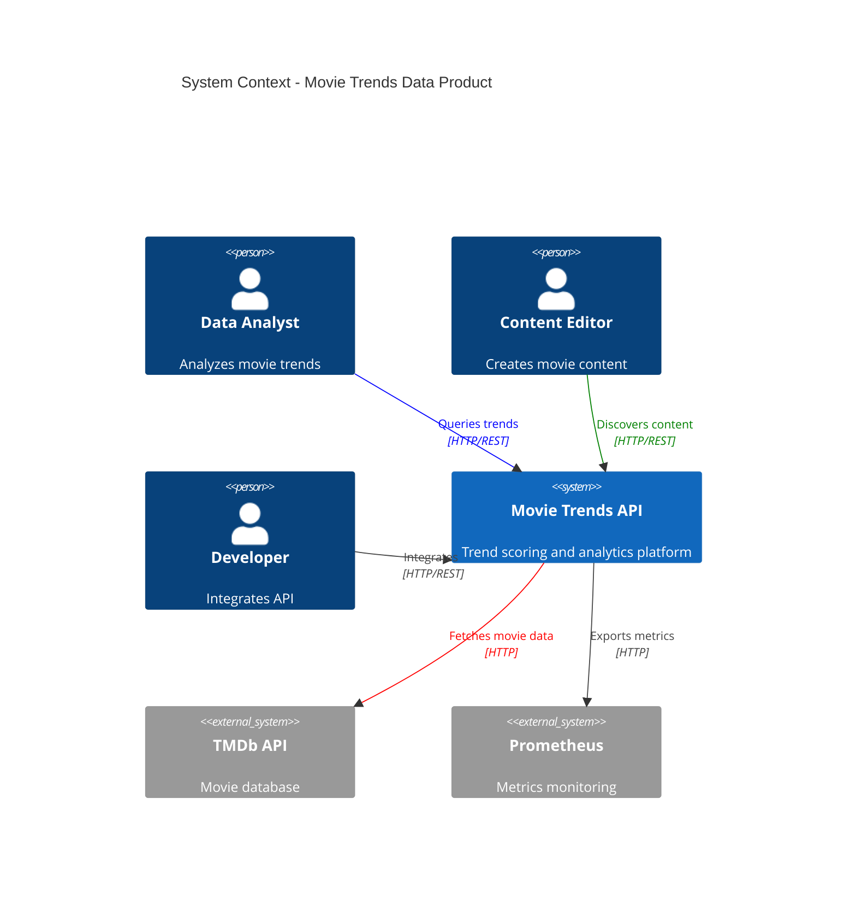
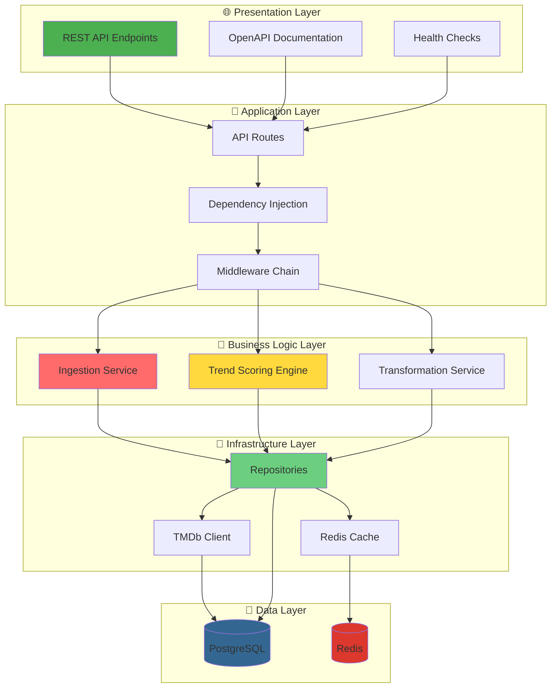
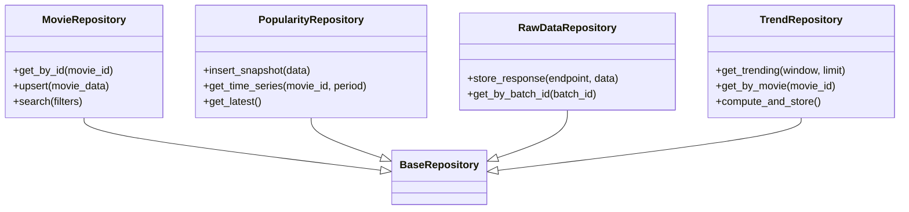
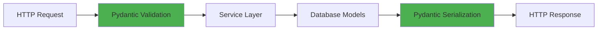
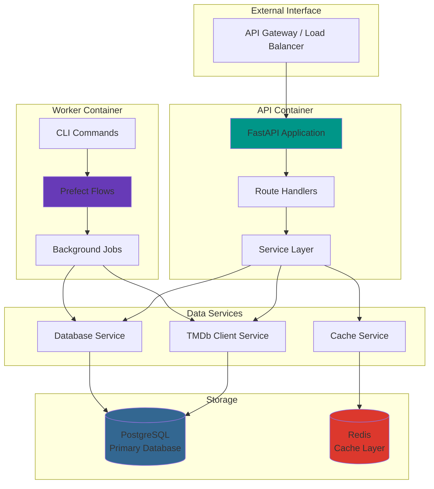
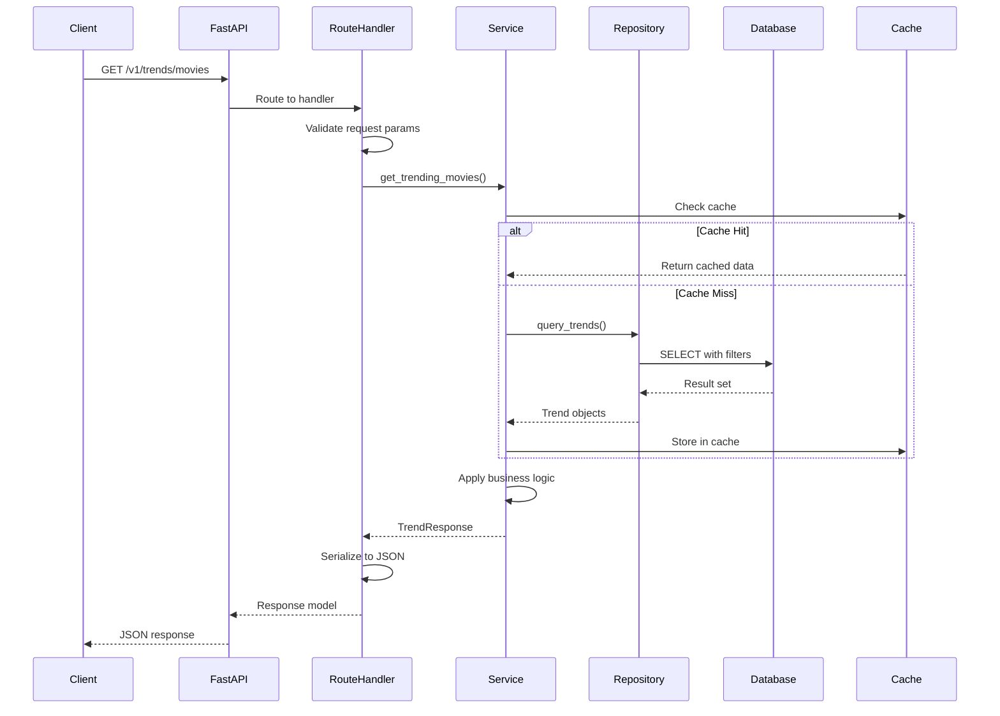
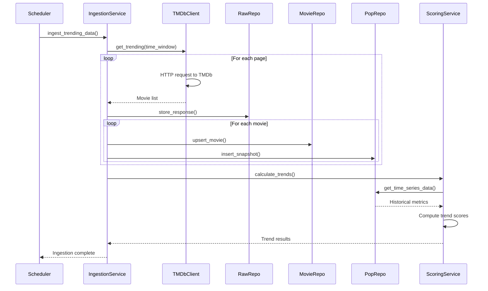
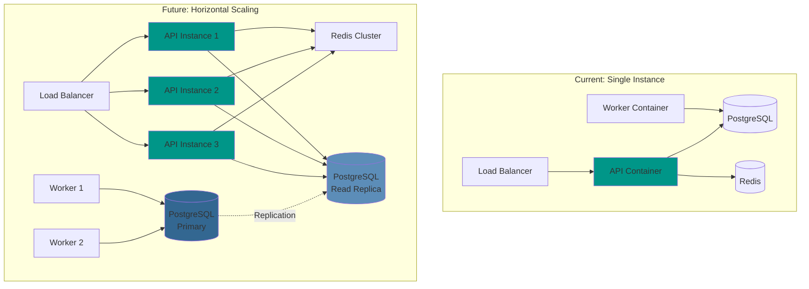
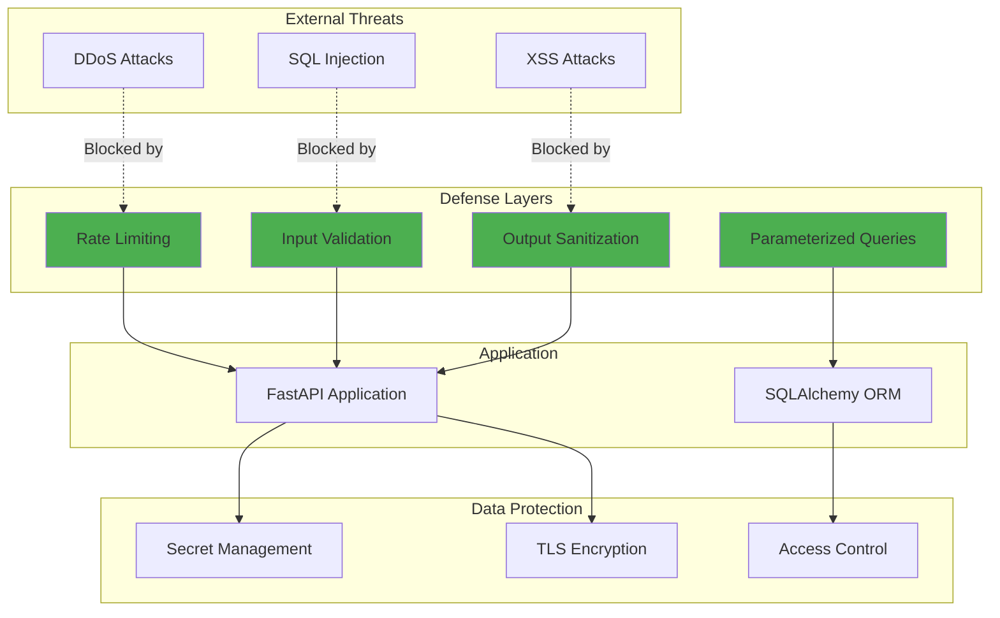

# Architecture Overview

## System Context

The Movie Trends API is a data product that transforms raw movie data from TMDb into actionable trend insights through a multi-layered architecture.



## Architectural Layers

The system follows a clean, layered architecture with clear separation of concerns:



## Core Principles

### 1. **Async-First Design**
All I/O operations are asynchronous for maximum throughput:

```python
# Concurrent API requests
async with TMDbClient() as client:
    movies = await client.get_trending("week")
    
# Non-blocking database queries
async with AsyncSession() as session:
    result = await session.execute(query)
```

### 2. **Repository Pattern**
Data access is abstracted behind repositories:



### 3. **Dependency Injection**
Services receive dependencies through constructors:

```python
class TrendScoringService:
    def __init__(
        self,
        movie_repo: MovieRepository,
        popularity_repo: PopularityRepository
    ):
        self.movie_repo = movie_repo
        self.popularity_repo = popularity_repo
```

### 4. **Type Safety**
Complete type coverage with Pydantic schemas:



## Service Architecture



## Component Interaction

### Request Lifecycle



### Data Ingestion Flow



## Scalability Design



## Technology Decisions

### Why FastAPI?
- **Performance**: Built on Starlette (async ASGI framework)
- **Developer Experience**: Auto-generated OpenAPI docs
- **Type Safety**: Native Pydantic integration
- **Modern**: Python 3.12+ with async/await

### Why PostgreSQL?
- **JSONB Support**: Store raw TMDb responses
- **Time-Series**: Efficient historical data queries
- **ACID Compliance**: Reliable transactions
- **Window Functions**: Complex analytical queries

### Why Redis?
- **Speed**: Sub-millisecond response times
- **TTL Support**: Automatic cache expiration
- **Atomic Operations**: Thread-safe increments
- **Pub/Sub**: Future real-time features

## Security Architecture



## Next Steps

- [System Design Details](system-design.md) - Component breakdown
- [Data Flow Architecture](data-flow.md) - Data movement patterns
- [API Layer Architecture](api-layer.md) - REST API design
