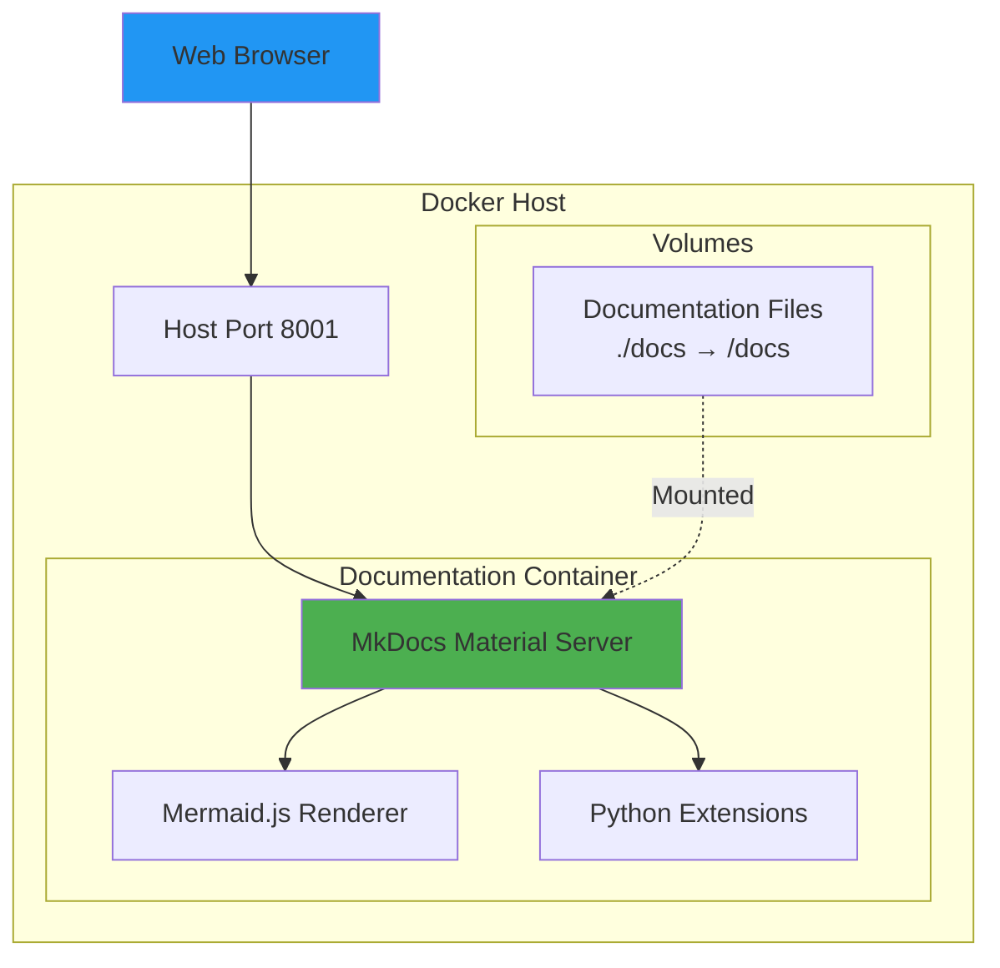
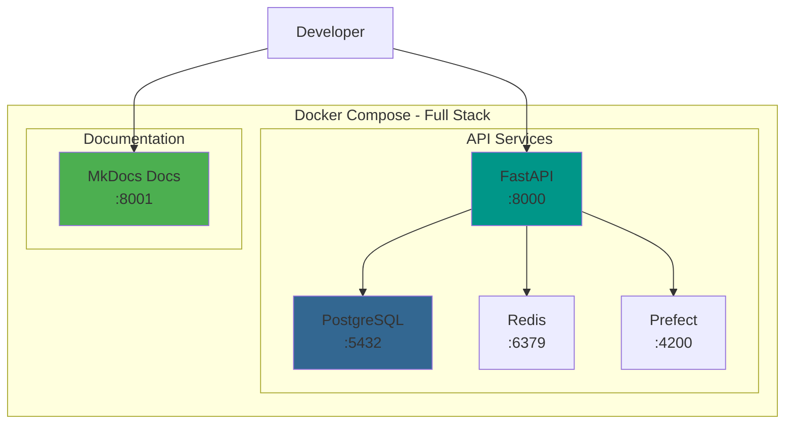

# Docker Deployment

## Quick Start

Launch the documentation site with Docker in 30 seconds:

```bash
# Navigate to docs directory
cd movie_trends_api/docs

# Build and start the documentation server
docker-compose up -d

# Open in browser
# http://localhost:8001
```

---

## Architecture



---

## Docker Compose Configuration

The `docker-compose.yml` defines the documentation service:

```yaml
version: '3.8'

services:
  docs:
    build:
      context: .
      dockerfile: Dockerfile
    container_name: movie-trends-docs
    ports:
      - "8001:8001"
    volumes:
      - ./:/docs
    restart: unless-stopped
    environment:
      - LIVE_RELOAD_SUPPORT=true
      - FAST_MODE=true
```

**Key Features**:
- 🔄 **Live Reload**: Changes to docs auto-refresh in browser
- 📦 **Volume Mounting**: Edit files locally, see changes instantly
- 🚀 **Fast Mode**: Optimized build times
- ♻️ **Auto-Restart**: Survives system reboots

---

## Dockerfile

Based on the official MkDocs Material image with additional plugins:

```dockerfile
FROM squidfunk/mkdocs-material:latest

# Install additional plugins
RUN pip install --no-cache-dir \
    mkdocs-mermaid2-plugin \
    mkdocs-git-revision-date-localized-plugin \
    mkdocs-minify-plugin \
    pymdown-extensions

WORKDIR /docs
EXPOSE 8001
CMD ["serve", "--dev-addr=0.0.0.0:8001"]
```

---

## Commands

### Start Documentation Server

```bash
# Start in detached mode
docker-compose up -d

# Start with logs visible
docker-compose up

# Start and rebuild image
docker-compose up --build
```

### Stop Documentation Server

```bash
# Stop and remove container
docker-compose down

# Stop but keep container
docker-compose stop
```

### View Logs

```bash
# Follow logs
docker-compose logs -f

# View last 50 lines
docker-compose logs --tail=50
```

### Rebuild Documentation

```bash
# Rebuild site inside container
docker-compose exec docs mkdocs build

# Force clean rebuild
docker-compose build --no-cache
docker-compose up -d
```

---

## Integration with Main API

Run both the API and documentation together:



### Combined docker-compose.yml

To run documentation alongside the API, create a root `docker-compose.yml`:

```yaml
version: '3.8'

services:
  # ... existing API services (postgres, redis, api) ...

  # Add documentation service
  docs:
    build:
      context: ./docs
      dockerfile: Dockerfile
    container_name: movie-trends-docs
    ports:
      - "8001:8001"
    volumes:
      - ./docs:/docs
    networks:
      - movie-trends-network

networks:
  movie-trends-network:
    driver: bridge
```

---

## Environment Variables

| Variable | Default | Description |
|----------|---------|-------------|
| `LIVE_RELOAD_SUPPORT` | `true` | Enable auto-reload on file changes |
| `FAST_MODE` | `true` | Skip plugin slowdowns during development |
| `DOCS_PORT` | `8001` | Port to expose documentation |

---

## Volume Mounts

The documentation container mounts the local docs directory:

```
./docs → /docs (in container)
```

**What's Mounted**:
- `mkdocs.yml` - Configuration
- `docs/` - All markdown files
- `docs/stylesheets/` - Custom CSS
- `docs/assets/` - Images and media

**Benefits**:
- ✏️ Edit files on host with your favorite editor
- 🔄 See changes instantly in browser
- 💾 No data loss on container restart

---

## Networking

The documentation service can be isolated or integrated:

### Isolated (Default)

```yaml
networks:
  docs-network:
    name: movie-trends-docs-network
    driver: bridge
```

### Integrated with API

```yaml
networks:
  movie-trends-network:
    driver: bridge
```

---

## Production Deployment

### Build Static Site

For production, build a static site:

```bash
# Build static files
docker-compose exec docs mkdocs build

# Output in ./site directory
# Serve with nginx, Apache, or any static host
```

### Nginx Configuration

```nginx
server {
    listen 80;
    server_name docs.movie-trends.example.com;
    
    root /var/www/movie-trends-docs;
    index index.html;
    
    location / {
        try_files $uri $uri/ =404;
    }
    
    # Cache static assets
    location ~* \.(js|css|png|jpg|jpeg|gif|ico|svg)$ {
        expires 1y;
        add_header Cache-Control "public, immutable";
    }
}
```

### Docker Production Image

```dockerfile
# Multi-stage build for production
FROM squidfunk/mkdocs-material:latest AS builder

WORKDIR /docs
COPY . .
RUN mkdocs build

FROM nginx:alpine
COPY --from=builder /docs/site /usr/share/nginx/html
EXPOSE 80
```

---

## Troubleshooting

### Container Won't Start

```bash
# Check logs
docker-compose logs docs

# Check port availability
netstat -an | grep 8001

# Use different port
# Edit docker-compose.yml: "8002:8001"
```

### Live Reload Not Working

```bash
# Ensure volume mount is correct
docker-compose exec docs ls -la /docs

# Restart container
docker-compose restart docs
```

### Mermaid Diagrams Not Rendering

```bash
# Rebuild with no cache
docker-compose build --no-cache docs

# Verify plugin installation
docker-compose exec docs pip list | grep mermaid
```

### Permission Issues (Linux)

```bash
# Fix ownership
sudo chown -R $USER:$USER docs/

# Or run with user mapping
docker-compose run --user $(id -u):$(id -g) docs
```

---

## CI/CD Integration

### GitHub Actions

```yaml
name: Deploy Documentation

on:
  push:
    branches: [main]
    paths:
      - 'docs/**'

jobs:
  deploy:
    runs-on: ubuntu-latest
    steps:
      - uses: actions/checkout@v3
      
      - name: Build documentation
        run: |
          cd docs
          docker-compose build
          docker-compose run docs mkdocs build
      
      - name: Deploy to GitHub Pages
        uses: peaceiris/actions-gh-pages@v3
        with:
          github_token: ${{ secrets.GITHUB_TOKEN }}
          publish_dir: ./docs/site
```

---

## Next Steps

- [Configuration Guide](configuration.md) - Customize the documentation
- [Monitoring](monitoring.md) - Track documentation usage
- [API Reference](../api/endpoints.md) - Explore the API
