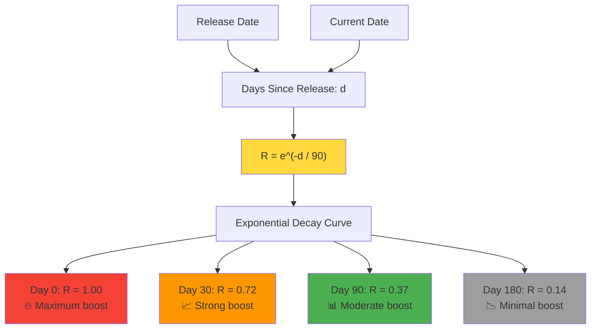
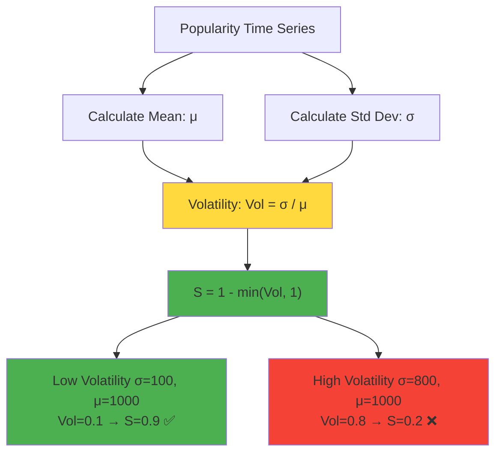
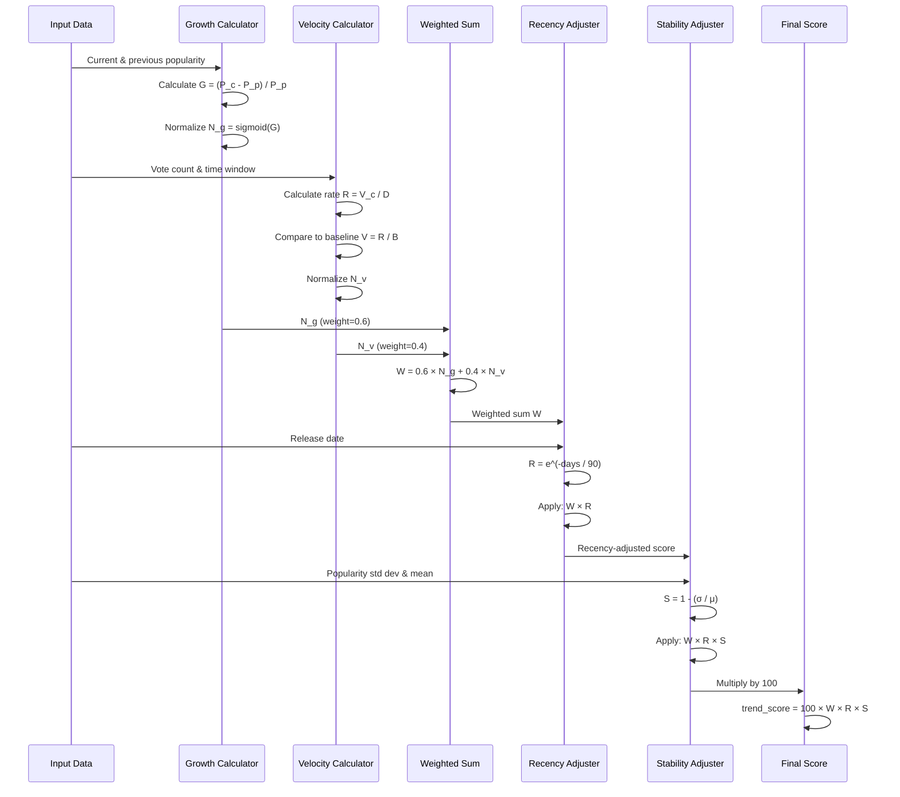
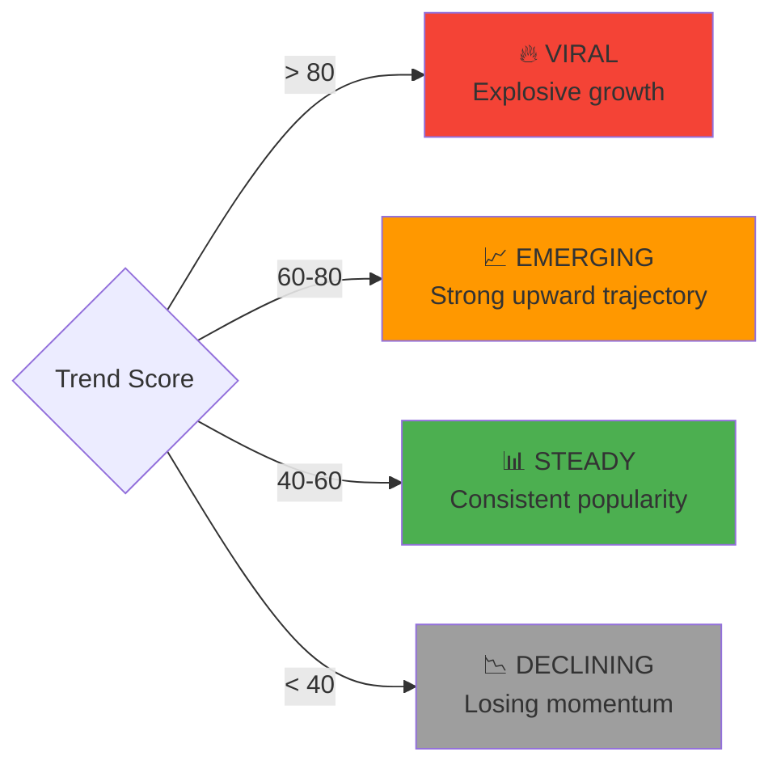
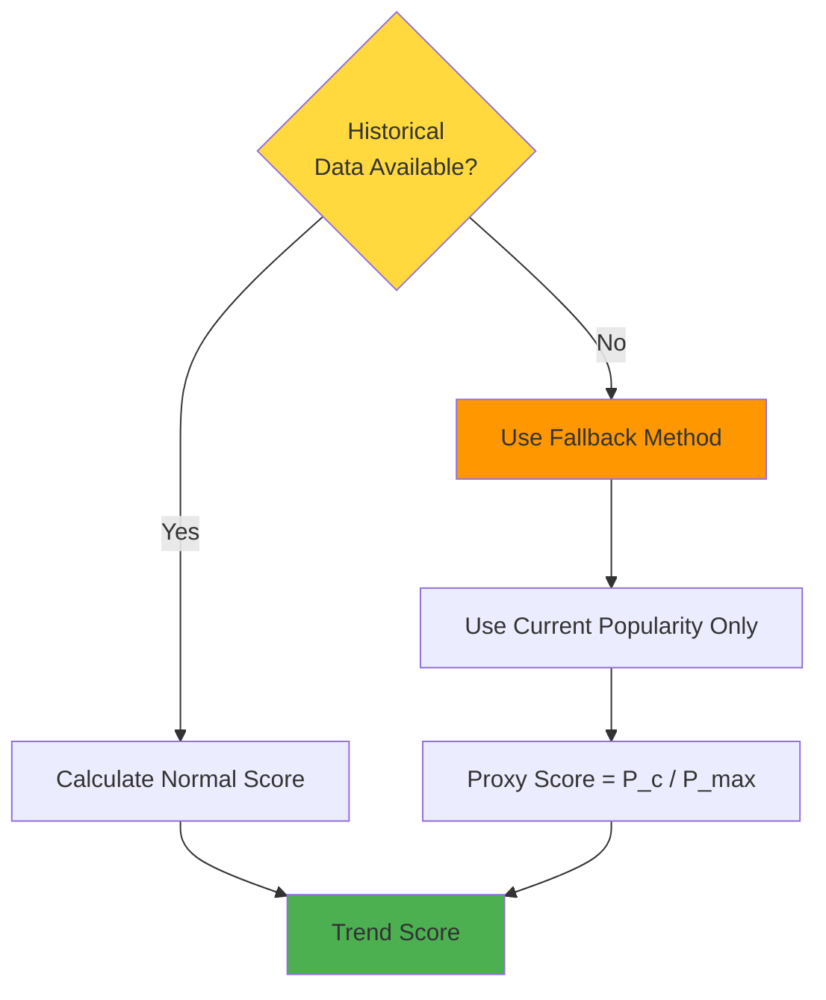

# Trend Calculation Deep Dive

## The Explainable Trend Formula

Unlike black-box algorithms, our trend score is **fully transparent and auditable**:

$$
\text{trend\_score} = 100 \times (w_1 \times N_g + w_2 \times N_v) \times R \times S
$$

Where:
- $N_g$ = Normalized popularity growth
- $N_v$ = Normalized vote velocity
- $R$ = Recency factor
- $S$ = Stability factor
- $w_1 = 0.6$ (growth weight)
- $w_2 = 0.4$ (velocity weight)

---

## Component Breakdown

### 1. Popularity Growth ($N_g$)

**Purpose**: Measures how much a movie's popularity is increasing

```mermaid
flowchart TB
    CURRENT[Current Week<br/>Popularity: P_c]
    PREVIOUS[Previous Week<br/>Popularity: P_p]
    
    CURRENT --> CALC[Calculate Growth]
    PREVIOUS --> CALC
    
    CALC --> GROWTH["G = (P_c - P_p) / P_p"]
    
    GROWTH --> EXAMPLE1[Example: 3000 → 4500<br/>G = 0.5 ✅ +50%]
    GROWTH --> EXAMPLE2[Example: 2000 → 1500<br/>G = -0.25 ❌ -25%]
    
    GROWTH --> NORMALIZE[Normalize to [0, 1]]
    NORMALIZE --> NG["N_g = sigmoid(G)"]
    
    style CALC fill:#FFD93D
    style GROWTH fill:#FF9800
    style NG fill:#4CAF50
```

**Normalization**: We use a sigmoid function to bound values:

$$
N_g = \frac{1}{1 + e^{-k \cdot G}}
$$

This ensures:
- Explosive growth (200%) → ~0.95
- Strong growth (50%) → ~0.80
- No growth (0%) → 0.50
- Decline (-25%) → ~0.30

---

### 2. Vote Velocity ($N_v$)

**Purpose**: Measures how fast a movie is accumulating new votes

```mermaid
flowchart TB
    CURRENT_VOTES[Current Vote Count: V_c]
    DAYS_WINDOW[Time Window: D = 7 days]
    BASELINE[30-day Average: B]
    
    CURRENT_VOTES --> RATE["Rate: R = V_c / D"]
    DAYS_WINDOW --> RATE
    
    RATE --> VELOCITY["Velocity: V = R / B"]
    BASELINE --> VELOCITY
    
    VELOCITY --> EXAMPLE1[Example: 1000 votes/week<br/>Baseline: 500<br/>V = 2.0 ✅ 2x baseline]
    
    VELOCITY --> NORMALIZE[Normalize to [0, 1]]
    NORMALIZE --> NV["N_v = min(V / V_max, 1)"]
    
    style RATE fill:#FFD93D
    style VELOCITY fill:#FF9800
    style NV fill:#4CAF50
```

**Why Vote Velocity Matters**:
- High vote velocity → Active audience engagement
- Low vote velocity → Stale or niche content
- Spike detection → Identifies viral moments

---

### 3. Recency Factor ($R$)

**Purpose**: Boost recently released movies



**Decay Half-Life**: ~62 days (when $R = 0.5$)

**Rationale**:
- New releases generate more buzz
- Older movies trend differently (nostalgia, anniversaries)
- Prevents old classics from dominating "trending"

---

### 4. Stability Factor ($S$)

**Purpose**: Penalize erratic, volatile trends



**Why Stability Matters**:
- **Smooth trends** → Predictable, actionable insights
- **Erratic spikes** → Random noise, not real trends
- **Bot detection** → Unusual patterns get downweighted

---

## Complete Calculation Workflow



---

## Worked Example

Let's calculate the trend score for **"Gladiator II"**:

### Input Data
```python
movie = {
    "title": "Gladiator II",
    "release_date": "2024-11-13",  # 38 days ago
    "current_popularity": 3456.8,
    "previous_popularity": 2450.3,
    "current_votes": 1250,
    "baseline_vote_rate": 650,
    "popularity_stddev": 210.5,
    "popularity_mean": 2953.5
}
```

### Step 1: Popularity Growth

$$
G = \frac{3456.8 - 2450.3}{2450.3} = 0.411 \text{ (+41.1%)}
$$

$$
N_g = \text{sigmoid}(0.411) = 0.755
$$

### Step 2: Vote Velocity

$$
V = \frac{1250 / 7}{650 / 7} = 1.923 \text{ (92.3% above baseline)}
$$

$$
N_v = \min(1.923 / 3, 1) = 0.641
$$

### Step 3: Weighted Sum

$$
W = 0.6 \times 0.755 + 0.4 \times 0.641 = 0.709
$$

### Step 4: Recency Factor

$$
R = e^{-38 / 90} = 0.659
$$

### Step 5: Stability Factor

$$
S = 1 - \frac{210.5}{2953.5} = 0.929
$$

### Final Score

$$
\text{trend\_score} = 100 \times 0.709 \times 0.659 \times 0.929 = \boxed{43.4}
$$

**Classification**: `STEADY` (40-60 range)

---

## Trend Classifications



---

## Edge Cases & Handling

### Zero Division Protection

```python
def safe_divide(numerator: float, denominator: float) -> float:
    """Prevent division by zero."""
    if denominator == 0:
        return 0.0
    return numerator / denominator
```

### Missing Historical Data



### Outlier Detection

```mermaid
flowchart TB
    VALUE[Metric Value] --> Z_SCORE["Z-Score = (x - μ) / σ"]
    
    Z_SCORE --> CHECK{|Z| > 3?}
    
    CHECK -->|Yes| OUTLIER[Flag as Outlier]
    CHECK -->|No| NORMAL[Normal Value]
    
    OUTLIER --> CAP[Cap at 3σ]
    NORMAL --> USE[Use As-Is]
    
    CAP --> CONTINUE[Continue Calculation]
    USE --> CONTINUE
    
    style CHECK fill:#FFD93D
    style OUTLIER fill:#F44336
    style NORMAL fill:#4CAF50
```

---

## Code Implementation

```python
@dataclass
class TrendComponents:
    """Fully decomposed trend score."""
    popularity_growth: float | None
    vote_velocity: float | None
    norm_popularity_growth: float
    norm_vote_velocity: float
    recency_factor: float
    stability_factor: float
    volatility: float | None
    trend_score: float
    trend_classification: str


def calculate_trend_score(
    current_metrics: MovieMetrics,
    previous_metrics: MovieMetrics | None,
    release_date: date,
    settings: TrendScoringSettings
) -> TrendComponents:
    """Calculate explainable trend score."""
    
    # 1. Popularity Growth
    if previous_metrics:
        growth = (current_metrics.avg_popularity - previous_metrics.avg_popularity) / previous_metrics.avg_popularity
        norm_growth = sigmoid(growth)
    else:
        growth = None
        norm_growth = 0.5  # Neutral
    
    # 2. Vote Velocity
    vote_velocity = current_metrics.avg_vote_count / settings.baseline_vote_count
    norm_velocity = min(vote_velocity / settings.max_velocity, 1.0)
    
    # 3. Weighted Sum
    weighted_sum = (
        settings.growth_weight * norm_growth +
        settings.velocity_weight * norm_velocity
    )
    
    # 4. Recency Factor
    days_since_release = (date.today() - release_date).days
    recency = math.exp(-days_since_release / settings.recency_halflife)
    
    # 5. Stability Factor
    volatility = current_metrics.popularity_stddev / current_metrics.avg_popularity
    stability = 1 - min(volatility, 1.0)
    
    # 6. Final Score
    trend_score = 100 * weighted_sum * recency * stability
    
    # 7. Classification
    if trend_score > 80:
        classification = "VIRAL"
    elif trend_score > 60:
        classification = "EMERGING"
    elif trend_score > 40:
        classification = "STEADY"
    else:
        classification = "DECLINING"
    
    return TrendComponents(
        popularity_growth=growth,
        vote_velocity=vote_velocity,
        norm_popularity_growth=norm_growth,
        norm_vote_velocity=norm_velocity,
        recency_factor=recency,
        stability_factor=stability,
        volatility=volatility,
        trend_score=trend_score,
        trend_classification=classification
    )
```

---

## Next Steps

- [Data Flow](../architecture/data-flow.md) - How data moves through the system
- [Pipeline Walkthrough](pipeline.md) - End-to-end data processing
- [API Examples](../api/examples.md) - See trend scores in action
