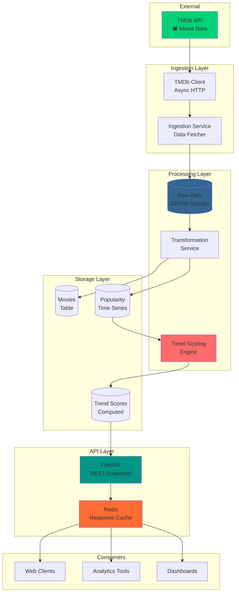
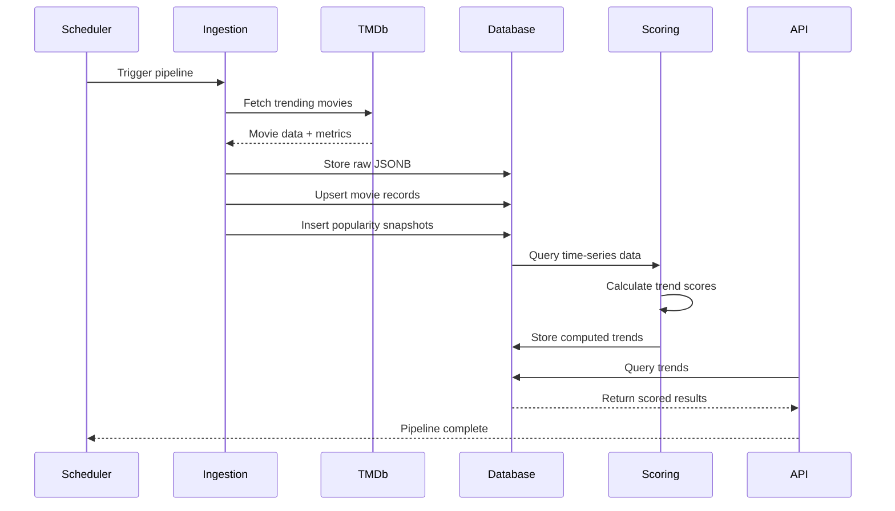

# 🎬 Movie Trends API Documentation

Welcome to the **Movie Trends Data Product API** documentation - your comprehensive guide to understanding, deploying, and using this production-ready movie analytics platform.

## What is the Movie Trends API?

A scalable REST API that continuously ingests movie data from TMDb (The Movie Database), calculates explainable trend scores, and exposes actionable insights for:

- 📊 **Data Analysts**: Access trend metrics and historical data
- ✍️ **Content Editors**: Discover trending movies for editorial content
- 🔬 **Data Scientists**: Export structured trend data for ML models
- 💼 **Product Teams**: Build features on top of trend intelligence

---

## 🎯 Key Features

<div class="grid cards" markdown>

-   :material-trending-up:{ .lg .middle } **Explainable Trends**

    ---

    Fully decomposed trend scores with transparency into every metric component

    🔍 No black boxes • Every factor is interpretable

-   :material-lightning-bolt:{ .lg .middle } **Real-Time Insights**

    ---

    Async ingestion pipeline continuously pulls fresh data from TMDb

    ⚡ FastAPI • PostgreSQL • Redis caching

-   :material-docker:{ .lg .middle } **Production Ready**

    ---

    Complete Docker setup with orchestration, monitoring, and observability

    🐳 Docker Compose • Prometheus • Structured logging

-   :material-source-branch:{ .lg .middle } **Clean Architecture**

    ---

    Repository pattern, dependency injection, comprehensive type safety

    🏗️ SOLID principles • MyPy validated • Pydantic schemas

</div>

---

## 🚀 Quick Start

Get the API running in 3 minutes:

```bash
# 1. Clone and navigate
cd movie_trends_api

# 2. Set up environment
cp .env.example .env
# Add your TMDB_API_KEY to .env

# 3. Start all services
docker-compose up -d

# 4. Initialize database
docker-compose exec api python -m movie_trends.cli init-db

# 5. Run data pipeline
docker-compose exec api python -m movie_trends.cli run-pipeline
```

**Access Points:**
- API Documentation: [http://localhost:8000/docs](http://localhost:8000/docs)
- Health Check: [http://localhost:8000/health](http://localhost:8000/health)
- Metrics: [http://localhost:8000/metrics](http://localhost:8000/metrics)
- Prefect UI: [http://localhost:4200](http://localhost:4200)

---

## 🏗️ System Architecture



---

## 📊 How Trends Work

The trend scoring formula is **fully explainable**:

$$
\text{trend\_score} = 100 \times (w_1 \times \text{norm\_pop\_growth} + w_2 \times \text{norm\_vote\_velocity}) \times \text{recency\_factor} \times \text{stability\_factor}
$$

Where:
- **norm_pop_growth**: Normalized popularity increase
- **norm_vote_velocity**: Rate of new votes received  
- **recency_factor**: Boost for recently released movies
- **stability_factor**: Penalty for volatile, unstable trends

Every component is transparent and auditable. [Learn more →](how-it-works/trend-calculation.md)

---

## 🔄 Data Pipeline Flow



[Explore the pipeline →](how-it-works/pipeline.md)

---

## 🎓 Core Concepts

### Movies
The fundamental entity representing a film with metadata (title, release date, genres).

### Popularity Snapshots
Time-series data capturing popularity metrics at specific points in time.

### Trend Scores
Computed metrics indicating how "trending" a movie is, with classification:
- **VIRAL**: Explosive growth (score > 80)
- **EMERGING**: Strong upward trajectory (60-80)
- **STEADY**: Consistent popularity (40-60)
- **DECLINING**: Losing momentum (< 40)

### Raw Data
Unprocessed JSONB storage of TMDb responses for auditability and reprocessing.

---

## 📖 Documentation Sections

### [Architecture](architecture/overview.md)
Understand the system design, layers, and how components interact.

### [Components](components/ingestion.md)
Deep dive into each service: ingestion, scoring, transformation, and APIs.

### [How It Works](how-it-works/pipeline.md)
Step-by-step guides on data flow, calculations, and request handling.

### [Deployment](deployment/docker.md)
Production deployment with Docker, configuration, and monitoring.

### [API Reference](api/endpoints.md)
Complete endpoint documentation with request/response examples.

---

## 🛠️ Technology Stack

<div class="grid" markdown>

=== "Backend"
    - **FastAPI** - Modern async web framework
    - **SQLAlchemy** - ORM with async support  
    - **Pydantic** - Data validation and serialization
    - **Python 3.12** - Latest Python features

=== "Storage"
    - **PostgreSQL 15** - Relational database with JSONB
    - **Redis 7** - Response caching layer
    - **Alembic** - Database migrations

=== "External Services"
    - **TMDb API** - Movie data source
    - **Prefect** - Workflow orchestration
    - **Prometheus** - Metrics and monitoring

=== "DevOps"
    - **Docker** - Containerization
    - **Docker Compose** - Multi-container orchestration
    - **MyPy** - Static type checking
    - **Pytest** - Testing framework

</div>

---

## 📈 Sample API Response

```json
{
  "meta": {
    "api_version": "v1",
    "time_window": "weekly",
    "as_of": "2025-12-21",
    "trend_definition_version": "1.0"
  },
  "data": [
    {
      "movie": {
        "movie_id": 558449,
        "title": "Gladiator II",
        "release_date": "2024-11-13",
        "genres": ["Action", "Adventure", "Drama"]
      },
      "trend_metrics": {
        "trend_score": 87.3,
        "trend_classification": "VIRAL",
        "popularity_growth": 0.45,
        "vote_velocity": 0.38,
        "recency_factor": 0.92,
        "stability_factor": 0.94
      },
      "trend_history": {
        "previous_score": 72.1,
        "delta": 15.2
      }
    }
  ]
}
```

---

## 🎯 Next Steps

<div class="grid cards" markdown>

-   [:octicons-rocket-24: Get Started](deployment/docker.md)

    Set up your local environment

-   [:octicons-architecture-24: Architecture](architecture/overview.md)

    Understand the system design

-   [:octicons-graph-24: How Trends Work](how-it-works/trend-calculation.md)

    Deep dive into the formula

-   [:octicons-code-24: API Reference](api/endpoints.md)

    Explore all endpoints

</div>

---

!!! tip "Interactive Documentation"
    This documentation includes interactive Mermaid diagrams. Click elements to explore connections and hover for tooltips!
